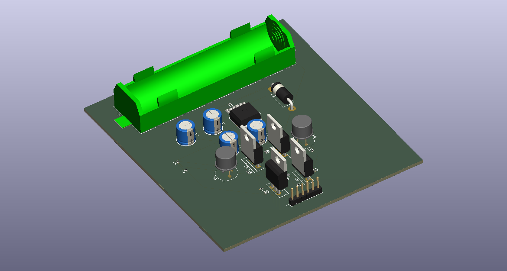

# H-Bridge-DC-Motor-Driver-with-PWM
H-Bridge DC Motor Driver using PWM with Proteus and KiCad.


# H-Bridge DC Motor Driver Using PWM Speed Control

<p align="center">
  
</p>

## 📌 Overview

This project presents the design and simulation of an **H-Bridge DC Motor Driver** using **PWM (Pulse Width Modulation)** for precise speed control and bidirectional motor operation.

The complete workflow includes:

- STM32F103C8T6 (Blue Pill) Firmware
- Proteus Simulation
- KiCad PCB Design
- Gerber Manufacturing Files
- Documentation
- Experimental Results

---

## 🚀 Features

- PWM-based DC Motor Speed Control
- Forward & Reverse Motor Rotation
- H-Bridge MOSFET Driver
- STM32F103C8T6 Microcontroller
- KiCad PCB Design
- Proteus Simulation
- Gerber Files for PCB Fabrication
- Complete Documentation

---

## 🛠️ Software Used

| Software | Purpose |
|----------|---------|
| STM32CubeIDE | Firmware Development |
| KiCad | PCB Design |
| Proteus | Circuit Simulation |
| Microsoft Excel | Data Analysis |
| PowerPoint | Presentation |

---

## 📂 Repository Structure

```text
H-Bridge-DC-Motor-Driver-with-PWM
│
├── Report
├── Proteus
├── KiCad
├── Components
├── Results
├── Media
└── Docs
```

---

## ⚡ Hardware Components

- STM32F103C8T6 Blue Pill
- IRF9530 P-Channel MOSFET
- IRFZ44N N-Channel MOSFET
- 2N2222 NPN Transistor
- DC Motor
- 12V Power Supply
- Passive Components

---

## 📊 Project Outputs

- Proteus Simulation
- KiCad PCB Layout
- 3D PCB Model
- PWM Waveforms
- Performance Analysis
- Experimental Results

---

## 📸 Project Gallery

### Proteus Simulation


### PCB Layout


### 3D PCB



---

## 📄 Documentation

- Project Report
- Presentation
- Abstract
- References
- BOM
- Cost Analysis

---

## 📜 License

This project is released under the MIT License.

---

## 👨‍💻 Author

Gnanesh Robbi
Nimisha Manikandan
Bharathraj Sarvanan
Arshiya Nishanadar
Rittam Das

---

⭐ If you found this repository useful, please consider giving it a Star.
